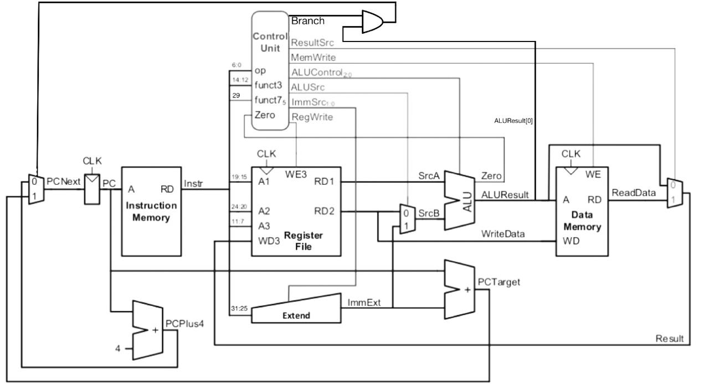

# RV32I Single-Cycle RISC-V Processor 

## Overview
This project implements a **32-bit RV32I single-cycle RISC-V processor** using **Verilog HDL**.
Implemented a complete datapath with ALU, register file, control unit, and instruction/data memory.
The processor follows a **single-cycle datapath**, meaning each instruction completes
fetch, decode, execute, memory access, and write-back within one clock cycle.

The processor supports R-type, I-type, load/store (S-type), and branch (B-type) instructions, 
demonstrating core CPU control and datapath concepts.

---

## Block Diagram


---

## Supported Instruction Formats
The processor supports the following **RV32I instruction formats**:

- **R-type** – Register arithmetic and logic
- **I-type** – Immediate arithmetic and load
- **S-type** – Store
- **B-type** – Conditional branch

---

## Implemented Instructions

### Arithmetic and Logical Instructions
- `add`, `sub`
- `and`, `or`
- `addi`

### Memory Access Instructions
- `lw` – Load word
- `sw` – Store word

### Branch Instructions
- `beq` – Branch if equal
- `bne` – Branch if not equal
- `blt` – Branch if less than
- `bgt` – Branch if greater than

---

## Control and Execution Flow
1. The **PC** supplies the address to instruction memory.
2. The **instruction fields** are decoded to generate control signals.
3. The **ALU** executes arithmetic, logic, or branch comparison operations.
4. **Data memory** is accessed for load/store instructions.
5. The selected result is written back to the register file.
6. The **PC** is updated with either `PC + 4` or a branch target address.

---

## Datapath Description
The processor datapath consists of the following interconnected blocks:

### 1. Program Counter (PC)
The **PC** holds the address of the current instruction. On every clock cycle, it is updated
either to:
- `PC + 4` for sequential execution, or
- A **branch target address** when a branch condition is satisfied.

### 2. Instruction Fetch
The PC value is used to access the **Instruction Memory**, which outputs a 32-bit instruction.
The instruction is divided into opcode, register indices, function fields, and immediate fields.

### 3. Instruction Decode & Control
The **Control Unit** decodes the opcode (and function fields) to generate control signals such as:
- `RegWrite`, `ALUSrc`, `MemWrite`
- `ResultSrc`, `Branch`, `ImmSrc`
- `ALUControl`

These signals control the behavior of the datapath for the current instruction.

### 4. Register File
The **Register File** provides two read operands (`rs1`, `rs2`) and supports writing back results
to the destination register (`rd`) during the write-back stage.

### 5. Immediate Generation
The **Immediate Generator** extracts and sign-extends immediates based on instruction type:
- I-type immediates for arithmetic and load instructions
- S-type immediates for store instructions
- B-type immediates for branch instructions

### 6. Execute (ALU)
The **ALU** performs:
- Arithmetic operations (add, subtract)
- Logical operations (and, or)
- Comparison operations for branch decisions (equal, not equal, less than, greater than)

The second ALU operand is selected either from the register file or the immediate generator
based on the `ALUSrc` control signal.

### 7. Memory Access
For load and store instructions:
- **Store (`sw`)** writes data from the register file to Data Memory
- **Load (`lw`)** reads data from Data Memory

### 8. Write Back
The **Write-Back MUX** selects either:
- The ALU result, or
- Data read from memory

The selected value is written back to the register file when `RegWrite` is asserted.

---

## Directory Structure
```
riscv-single-cycle-cpu/
│
├── src/        # Verilog RTL files
├── tb/         # Testbench files
├── memfiles/   # Instruction memory files
├── waves/      # Instruction memory files
├── docs/       # Block diagram and documentation
└── README.md
```

---

## Tools Used
- Verilog HDL
- Icarus Verilog
- GTKWave

---

## Block Diagram


---

## Future Work
- Pipeline implementation
- Hazard detection and forwarding
- Expanded RV32I instruction support

---


